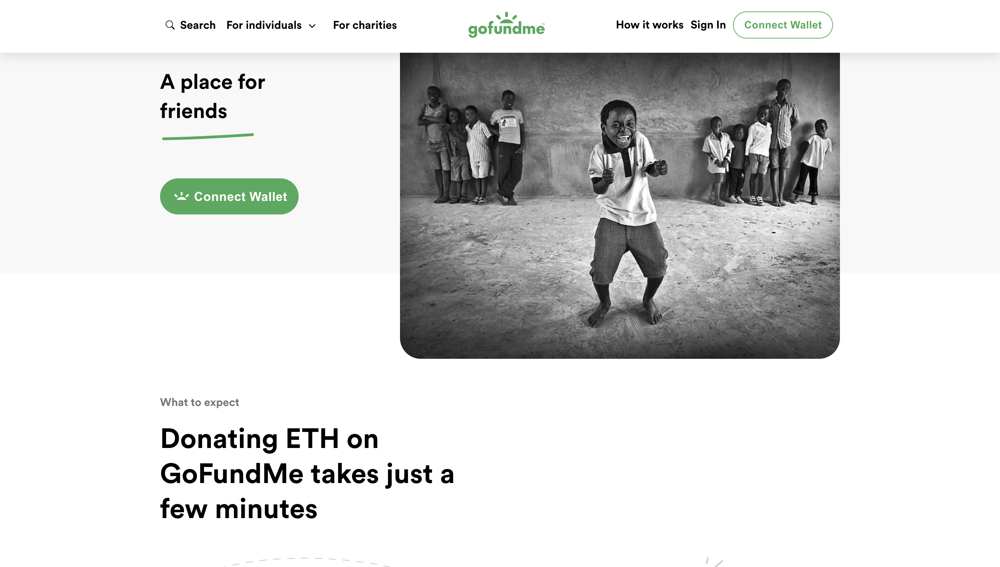
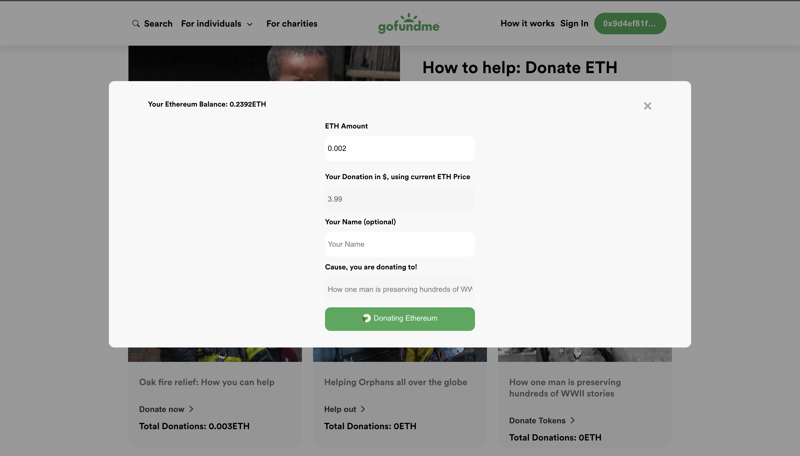

# petsDonate
A simple web3 goFundME app.

## tools used
react and scss for the front end, formik and yup for validation, react-icons for icons and solidity for writing the smart contract.
The contract is deployed on a goerli network. You can get fake eth from alchemy to your wallet address to test the app.

This is a simple blockchain project that allows you to donate tokens(ethereum) to charities or causes.
The smart contract written in solidity is deployed on a goerli network.

## what are the features of this project

<- `Connect to Metamask`: when you open the app, it checks, if you have metamask installed on your browser,
If you don't, there is a button that when clicked, it links to the browser extensions download page(in my case, chrome).

  
<- `After connecting your wallet`: You can choose the cause you want to donate your tokens(ETH) to, by simply clicking
on the donate tokens or help button. A modal window comes up!

 
On the modal window, you can see that your wallet etheruem balance is showed, there is a live conversion of your desired donation 
to USD using the current price of Ethereum which is fetched from a coin price API. The form is validated with formik and yup, which
does not allow you to donate more than your wallet balance. 

<- `Metamask Transaction`: After you have inputted your desired amount of ethereum that you wished to donate, you are being directed to 
metamask and you approve your transaction. You are then brought back to the app. after page refresh, your balanace will reduce by the amount you donated.
You can also see the total donations made to each cause.

